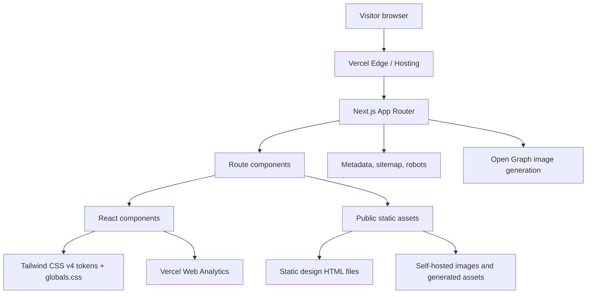
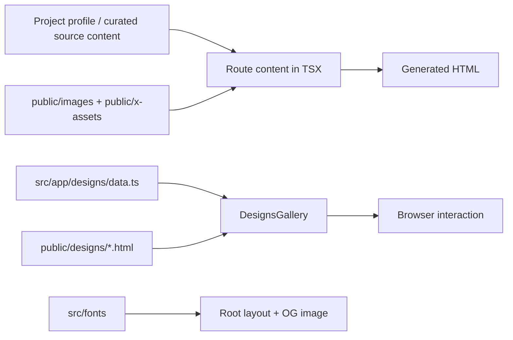

# Architecture

This document describes the architecture of `rauhut.com`, the personal web presence of German Rauhut.

## Context And Goals

`rauhut.com` is a small, content-heavy personal website with a strong emphasis on performance, privacy, accessibility, and maintainability. The site presents German Rauhut as a Technical Product Owner and AI Product Builder, links to the broader Neckarshore AI ecosystem, and provides a design gallery for UI explorations.

The architecture optimizes for four goals:

1. Fast static delivery through Vercel and the Next.js App Router.
2. Minimal client-side JavaScript, limited to real interaction needs.
3. Privacy-friendly analytics and self-hosted assets.
4. Clear content ownership without introducing a CMS.

## System Overview

## Runtime Architecture

| # | Layer | Implementation | Responsibility |
|---|-------|----------------|----------------|
| 1 | Hosting | Vercel | Serves the production site and handles automatic deployments. |
| 2 | Framework | Next.js 16 App Router | Defines routes, metadata, generated images, sitemap, and robots output. |
| 3 | UI Runtime | React 19 | Renders server and client components. |
| 4 | Styling | Tailwind CSS v4 with `@theme` tokens | Provides utility classes and runtime-overridable design tokens. |
| 5 | Analytics | `@vercel/analytics` | Provides cookieless web analytics without a cookie banner. |
| 6 | Tests | Playwright | Covers the homepage (German and English), language toggle, theme toggle, imprint, and the design gallery route with linked static design assets. |

## Route Model

| # | Route | Source | Rendering Model | Purpose |
|---|-------|--------|-----------------|---------|
| 1 | `/` | `src/app/page.tsx` | App Router page | German homepage and default canonical page. |
| 2 | `/en` | `src/app/en/page.tsx` | App Router page | English homepage with localized metadata. |
| 3 | `/impressum` | `src/app/impressum/page.tsx` | App Router page | German legal imprint, marked `noindex`. |
| 4 | `/designs` | `src/app/designs/page.tsx` | App Router page with client gallery | Index for 28 static UI design explorations. |
| 5 | `/designs/rauhut-*.html` | `public/designs/*.html` | Static public files | Standalone design exploration pages. |
| 6 | `/sitemap.xml` | `src/app/sitemap.ts` | Metadata route | Sitemap with German and English alternates. |
| 7 | `/robots.txt` | `src/app/robots.ts` | Metadata route | Allows crawling and points crawlers to the sitemap. |
| 8 | `/opengraph-image` | `src/app/opengraph-image.tsx` | Dynamic image route | Generates the social sharing image. |
| 9 | `/twitter-image` | `src/app/twitter-image.tsx` | Re-exported dynamic image route | Shares the same image implementation as Open Graph. |

## Component Boundaries

Most page content is server-rendered. Client components are used only where browser APIs or local interaction are required.

| # | Component | Type | Responsibility |
|---|-----------|------|----------------|
| 1 | `ThemeToggle` | Client | Toggles `<html data-theme>` and persists the choice in `localStorage`. |
| 2 | `FounderPhoto` | Client | Switches between two local portrait images on click. |
| 3 | `Reveal` | Client | Adds progressive scroll-enter animation via `IntersectionObserver`. |
| 4 | `DesignsGallery` | Client | Handles gallery filtering and iframe preview scaling. |
| 5 | `FilterBar` | Client | Controls gallery tag filters and opens the shuffle tour. |
| 6 | `ShuffleTour` | Client | Runs the modal tour for the static design pages. |
| 7 | `PersonJsonLd` | Server | Emits parseable Schema.org `Person` JSON-LD in rendered HTML. |
| 8 | `ProjectTiles`, `StatsRow`, `Timeline`, `ContactCards`, `LangToggle` | Server | Render structured content and navigation without client state. |

## Data And Content Flow

The site has no database and no CMS. Content is compiled from TypeScript, static assets, and checked-in HTML files.

Content localization is explicit rather than framework-driven:

1. German is the default route and default document language.
2. English lives under `/en`.
3. Shared components accept `lang` props when copy differs.
4. The English page sets `lang="en"` on `<main>` while the root `<html>` remains German.

## Styling And Theming

The visual system is defined in `src/app/globals.css`.

| # | Concern | Implementation |
|---|---------|----------------|
| 1 | Default theme | Dark mode via `<html data-theme="dark">`. |
| 2 | Light mode | Runtime override through `:root[data-theme="light"]`. |
| 3 | Design tokens | Tailwind v4 `@theme` variables for text, background, border, accent, and spacing values. |
| 4 | Font | Self-hosted Inter subset via `next/font/local`. |
| 5 | Reduced motion | Global `prefers-reduced-motion: reduce` handling plus explicit `Reveal` guard. |
| 6 | Focus states | Global `:focus-visible` outline using the accent token. |

The theme is intentionally DOM-driven. `public/theme-init.js` runs before first paint and updates `data-theme` when a stored light-mode preference exists. `ThemeToggle` then mutates the same attribute directly. React state is not used for theme synchronization, which avoids hydration drift and unnecessary rerenders.

## SEO, Metadata, And Structured Data

The architecture relies on Next.js metadata routes and page-level metadata.

| # | SEO Concern | Implementation |
|---|-------------|----------------|
| 1 | Canonicals | Set per page through `metadata.alternates.canonical`. |
| 2 | Hreflang | German and English alternates in page metadata and sitemap entries. |
| 3 | Robots | Homepage, English page, and gallery are indexable; imprint is `noindex`. |
| 4 | Sitemap | Generated by `src/app/sitemap.ts` for `/`, `/en`, and `/impressum`. |
| 5 | Structured data | `PersonJsonLd` emits native `application/ld+json` script tags. |
| 6 | Social images | Open Graph and Twitter image routes share one generated image design. |

`PersonJsonLd` deliberately uses a raw `<script>` tag rather than `next/script`, because the JSON-LD must be present as parseable HTML, not escaped into a hydration payload.

## Privacy And Compliance Posture

The site is designed to avoid consent-banner complexity.

| # | Area | Posture |
|---|------|---------|
| 1 | Analytics | Vercel Web Analytics only, cookieless. |
| 2 | Fonts | Self-hosted Inter files, no Google Fonts runtime request. |
| 3 | Trackers | No Google Analytics, Plausible, Sentry, pixels, or third-party embeds. |
| 4 | Cookies | No site cookies. Theme preference uses `localStorage`. |
| 5 | Legal page | `/impressum` is German-only and excluded from indexing. |

## Accessibility Posture

| # | Concern | Implementation |
|---|---------|----------------|
| 1 | Minimum font size | 12px hard floor. Tailwind utilities below `text-xs` (12px) are forbidden in production markup. |
| 2 | Minimum touch targets | 24px minimum for interactive controls (dots, buttons, icon-only triggers). Enforced in `ShuffleTour` navigation. |
| 3 | Focus management | Global `:focus-visible` outline using the accent token. Modal components (`ShuffleTour`) implement a focus trap so keyboard users cannot escape the modal accidentally. |
| 4 | Reduced motion | Global `prefers-reduced-motion: reduce` handling plus an explicit `Reveal` guard for scroll animations. |
| 5 | Semantic structure | Pages use a single `<h1>`, hierarchical `<h2>`/`<h3>`, semantic landmarks (`<main>`, `<nav>`, `<footer>`), and ARIA roles only where native semantics are insufficient. |
| 6 | Language metadata | `<html lang>` defaults to German. The English page sets `lang="en"` on `<main>` to keep screen readers in sync without splitting the route tree. |

Lighthouse Accessibility score is 100 on desktop and mobile per the latest baseline in `README.md`.

## Build, Test, And Deployment Flow

Local development runs on port `3001` to avoid collisions with related projects.

| # | Command | Purpose |
|---|---------|---------|
| 1 | `npm run dev` | Starts the Next.js dev server on `http://localhost:3001`. |
| 2 | `npm run build` | Produces the production build. |
| 3 | `npm run start` | Serves the production build on port `3001`. |
| 4 | `npm run lint` | Runs ESLint. |
| 5 | `npm run test:e2e` | Runs Playwright tests against the local dev server. |

Deployment follows the repository convention:

1. Work happens on a branch.
2. A pull request is opened.
3. The user merges the pull request.
4. Vercel deploys automatically through the GitHub integration.

Direct production deployment via `vercel --prod` is not part of the normal flow.

## Key Decisions

### Decision 1: Static-first personal site

**Decision:** Keep the website as a small static-first Next.js app without a CMS or database.

**Rationale:** The content changes infrequently, and the operational risk of a CMS would outweigh the benefit. Checked-in content keeps the site inspectable, reviewable, and deployable through the normal Git flow.

**Affects:** Route pages, content workflow, deployment, and absence of backend infrastructure.

### Decision 2: Dark mode as default theme

**Decision:** Render dark mode by default and allow a light-mode override.

**Rationale:** The personal brand intentionally uses a minimal black, white, gray, and pastel accent system. Default dark rendering also avoids a flash when no preference exists.

**Affects:** `src/app/layout.tsx`, `src/app/globals.css`, `public/theme-init.js`, and `ThemeToggle`.

### Decision 3: DOM-driven theme state

**Decision:** Store active theme in `<html data-theme>` and `localStorage`, not React state.

**Rationale:** The theme must be available before hydration to prevent visual flashing. Keeping the toggle DOM-driven avoids unnecessary state synchronization and React 19 effect-state pitfalls.

**Affects:** `ThemeToggle`, `theme-init.js`, and theme selectors in `globals.css`.

### Decision 4: Explicit bilingual routes

**Decision:** Implement German and English as explicit routes instead of a dynamic locale segment.

**Rationale:** The site has only two public language variants and a German-only imprint. Explicit routes keep the route tree simple and make metadata easier to inspect.

**Affects:** `/`, `/en`, `LangToggle`, sitemap alternates, and page metadata.

### Decision 5: JSON-LD as rendered HTML

**Decision:** Emit Schema.org Person data through a raw `application/ld+json` script tag.

**Rationale:** Search engines and AI crawlers need the structured data in rendered HTML. Escaped hydration payloads are not equivalent.

**Affects:** `PersonJsonLd` and structured-data verification after deployment.

### Decision 6: Static design explorations under `public/designs`

**Decision:** Keep individual design explorations as standalone static HTML files and index them through a Next.js gallery page.

**Rationale:** The explorations are self-contained artifacts. Keeping them static preserves their independence while the gallery provides discoverability, filtering, and preview interaction.

**Affects:** `public/designs/*.html`, `src/app/designs/data.ts`, `DesignsGallery`, `DesignCard`, and Playwright tests.

### Decision 7: SpaceX hero image interval at 2000 ms

**Decision:** The SpaceX-style cycling hero image transitions every 2000 ms, not the original 150 ms.

**Rationale:** At 150 ms the imagery cycled faster than a viewer could read or recognize each frame, defeating the purpose of the visual. 2000 ms preserves the kinetic feeling while keeping the content legible.

**Affects:** The hero component on `/designs` related rauhut-spacex page.

### Decision 8: `rauhut-luxury.html` design exploration excluded

**Decision:** The original 14th design exploration (`rauhut-luxury.html`) is intentionally not part of the published gallery.

**Rationale:** The file was deleted before integration. The gallery renders 28 cards and the `Design` interface comment documents the skip.

**Affects:** `public/designs`, `src/app/designs/data.ts`, gallery card count assertions in `tests/designs.spec.ts`.

### Decision 9: Gallery page uses `max-w-7xl`, main pages stay `max-w-2xl`

**Decision:** The `/designs` page uses a wide `max-w-7xl` container; the main bilingual pages keep the narrower `max-w-2xl` CV column.

**Rationale:** The gallery needs a multi-column grid for 28 cards; the CV pages prioritize linear reading flow in a single column.

**Affects:** `src/app/designs/page.tsx`, `src/app/page.tsx`, `src/app/en/page.tsx`.

### Decision 10: Security overrides for transitive CVE fixes

**Decision:** Patch transitive-dependency CVEs through the `overrides` field in `package.json` when the upstream framework has not yet released a bumped pin, instead of waiting on framework releases or accepting `npm audit fix --force` semver-major downgrades.

**Rationale:** Frameworks like Next.js pin transitive dependencies to specific patch versions for testing reproducibility. When a CVE lands in that pinned version, `npm audit fix --force` often proposes downgrading the framework (e.g. `next@9.3.3`), which is unacceptable. `overrides` performs a surgical minor-bump within the same major, verified by build, lint, and Playwright e2e gates. The first application was `postcss: 8.5.15` (PR #7, 2026-05-19), closing `GHSA-qx2v-qp2m-jg93` while preserving `next@16.2.6`.

**Affects:** `package.json` (`overrides` block), CVE response workflow, future Next.js patch bumps that must verify whether overrides can be relaxed.

## Operational Notes

| # | Topic | Note |
|---|-------|------|
| 1 | DNS | Domain is registered at IONOS; production hosting is Vercel. Mail remains with IONOS. |
| 2 | Google Search Console | Domain property is parked because IONOS Domain Connect risks overwriting MX records. URL-prefix verification and sitemap submission are sufficient for the current site shape. |
| 3 | Static assets | Images, fonts, and social assets are checked in to keep runtime requests predictable. |
| 4 | Open Graph fonts | OG image generation reads TTF files from `src/fonts` because Satori does not accept WOFF2. |
| 5 | Test coverage | `tests/site.spec.ts` covers German and English homepages, language toggle, theme toggle, and the imprint route. `tests/designs.spec.ts` covers gallery discoverability, link health, the 28-card render, and static-page controls. |
| 6 | Security overrides | `package.json` uses `overrides` to force patched transitive dependencies when an upstream framework has not yet bumped its pinned version. Current override: `postcss: 8.5.15` (closes GHSA-qx2v-qp2m-jg93). |

## Known Constraints

| # | Constraint | Impact |
|---|------------|--------|
| 1 | No CMS | Content edits require code changes and redeployment. This is intentional for now. |
| 2 | Manual visual acceptance | Objective checks can pass, but subjective visual approval remains a user decision. |
| 3 | English route inherits German root document language | The English page sets `lang="en"` on `<main>` instead of using a separate locale layout. |
| 4 | Static design pages bypass React | Shared site behavior does not automatically apply inside `public/designs/*.html`. |

## Extension Points

| # | Extension | Preferred Approach |
|---|-----------|--------------------|
| 1 | New public route | Add a route under `src/app`, page metadata, sitemap entry if indexable, and tests where behavior is interactive. |
| 2 | New bilingual content component | Keep shared structure in a component and pass `lang` for localized copy. |
| 3 | New design exploration | Add the HTML file under `public/designs`, register it in `src/app/designs/data.ts`, and run `npm run test:e2e`. |
| 4 | New tracking or analytics | Reject by default unless it remains cookieless and does not require a banner. |
| 5 | New third-party asset | Prefer self-hosting; document privacy and licensing implications before adding runtime third-party requests. |
